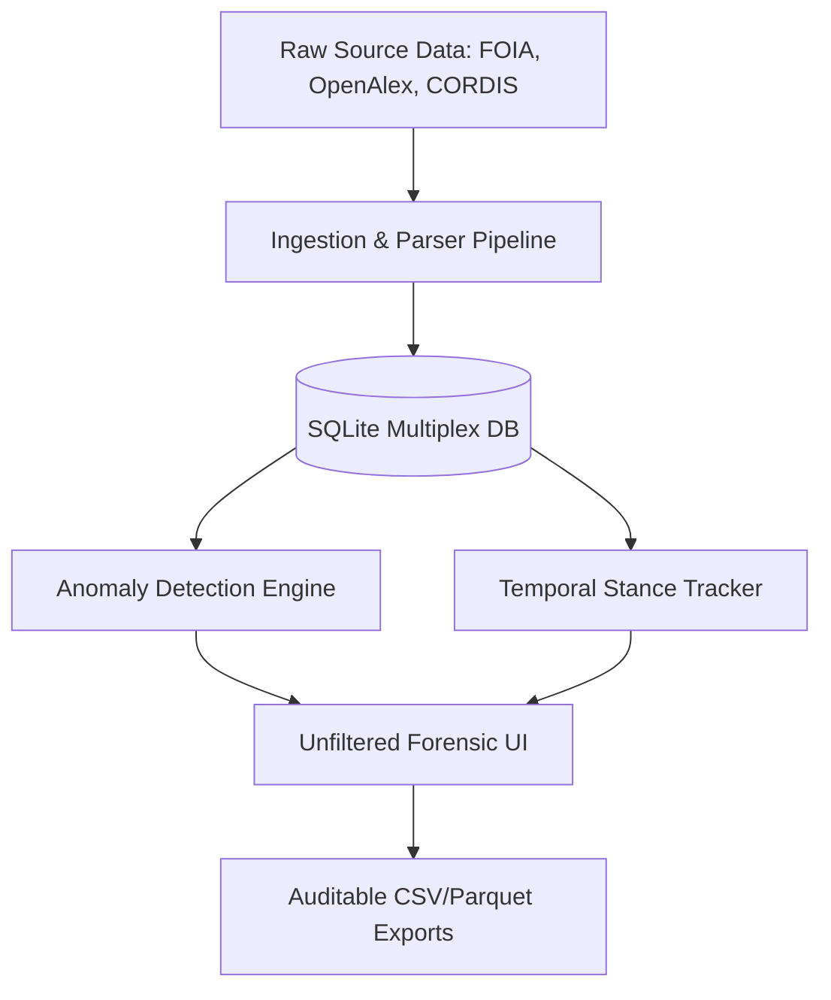

# Forensic Upgrade Roadmap — Unfiltered Truth-Finding Platform

This roadmap details the concrete technical and data engineering upgrades required to transition the Dutch Virology Network Analysis toolkit from a research prototype into an unfiltered, expert-grade forensic intelligence workstation.

---

## 1. Technical Architecture Upgrades

### 1.1 The Anomaly Detection Engine (Informal vs. Formal Delta)
*   **The Problem:** Official bibliographies (OpenAlex) do not capture informal influence, private reviews, or deliberate omissions (e.g., reviewing drafts without authorship credit).
*   **The Solution:** Build a cross-reference database layer matching text-mined entities from private correspondence (e.g., Fauci emails) against official publication metadata.
*   **Technical Implementation:**
    1.  Add a `draft_reviewers` table to SQLite tracking entities in emails discussing drafts of papers.
    2.  Query the Crossref API to retrieve the official author list for those papers.
    3.  Compute the **Silent Contributor Index (SCI)**:
        $$\text{SCI} = \frac{\text{Informal Review Mentions}}{\text{Official Author Credit}}$$
    4.  Flag nodes where $\text{SCI} > 0$ and official authorship is $0$.

### 1.2 European & Dutch Funding Trails (CORDIS & ZonMw Ingestors)
*   **The Problem:** Current funding data is heavily biased towards U.S. NIH grants. The multi-million funding streams from the European Commission and ZonMw that sustained the Dutch virology core are missing.
*   **The Solution:** Integrate European Commission CORDIS API and ZonMw public grant databases.
*   **Technical Implementation:**
    *   Implement an ingest script `src/ingest_cordis.py` querying the EC CORDIS API for Horizon 2020 projects matching the target ROR codes (`https://ror.org/018906e22` for Erasmus MC) or target names.
    *   Extract the **Funding Flow Edge** `(Funder) -[FUNDED {amount}]-> (Researcher/Institution)`.
    *   Represent consortia (e.g., VEO, COMPARE, NCOH) not as floating nodes, but as hubs of directed financial flow.

### 1.3 Chronological Stance-Evolution Matrix (Narrative Drift)
*   **The Problem:** Stances are currently represented statically. Truth-seekers need to analyze how statements changed over time under peer or political pressure.
*   **The Solution:** Implement a **Temporal Stance Drift Matrix**.
*   **Technical Implementation:**
    1.  Categorize statements (evidence quotes) by date and stance type (e.g., `[LAB_ORIGIN_POSSIBLE]`, `[LAB_ORIGIN_IMPOSSIBLE]`, `[NATURAL_ORIGIN]`).
    2.  Calculate the **Narrative Drift Rate** for each researcher, mapping the chronological transition from private emails (Jan-Feb 2020) to public papers (March 2020 onward).
    3.  Render a split-screen timeline in the UI showing **Private Stance vs. Public Statement** side-by-side for any selected researcher.

### 1.4 Genetic & Methodological Feature Mapping (Technical Capabilities)
*   **The Problem:** Categorizing researchers by ideological camps ("lab-leak" vs. "natural") is unscientific. Analysts need to map actual *technical capabilities*.
*   **The Solution:** Replace ideological labels with a **Methodological Capability Layer**.
*   **Technical Implementation:**
    *   Map technical genetic features as nodes (e.g., `Furin Cleavage Site`, `BsmBI/BsaI Restriction Site Cloning`, `Serial Passage in Transgenic Mice`).
    *   Create edges `(Researcher) -[PUBLISHED_METHOD]-> (Genetic Feature)` based on text-mining their historical publication abstracts.
    *   This maps who had the *proven laboratory experience* to execute specific genetic modifications discussed in the origins debate.

### 1.5 Decoupled "No-Filter" UI Layout
*   **The Problem:** The current UI has a single visual network that gets cluttered.
*   **The Solution:** Split the Web UI into three dedicated forensic panels:
    *   **Panel A (Relation Network):** Spatial representation of co-authorships and funding.
    *   **Panel B (Chronological Event Ledger):** A vertical Gantt-style timeline cross-referencing emails, drafts, and public statements day-by-day.
    *   **Panel C (Audit trail):** Displays the cryptographic hash (SHA-256), OCR source image, page reference, and a permanent WebArchive/IPFS link for the active node's evidence.

---

## 2. Implementation Action Plan

| Step | Component | Action | Target Outcome |
|---|---|---|---|
| **1** | Ingestion | Write `src/ingest_cordis.py` and `src/ingest_zonmw.py` | Complete European funding flow layers. |
| **2** | DB Schema | Add `informal_interactions` and `narrative_drift` tables | Store temporal stance changes. |
| **3** | Analysis | Implement anomaly detection (SCI score calculation) | Highlight hidden advisory roles. |
| **4** | UI/UX | Split interface into Network, Timeline Ledger, and Hash Audit | Expert-grade analytical interface. |
